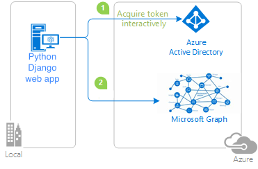

# Sample: A Python Django web project to sign in users and call APIs with the Microsoft Entra ID

This is a Python web application that uses the
[Django framework](https://www.djangoproject.com/)
and the
[Microsoft Entra ID](https://www.microsoft.com/security/business/microsoft-entra)
to sign in users and make authenticated calls to the Microsoft Graph API.



## Getting Started

### Prerequisites

- Register your web application in the Microsoft Entra admin center,
  by following step 1, 2 and 3 of this
  [Quickstart: Add sign-in with Microsoft to a Python web app](https://learn.microsoft.com/en-us/entra/identity-platform/quickstart-web-app-python-sign-in?tabs=windows)
- Have [Python](https://python.org) 3.8+ installed

### Installation

1. This sample already implements sign-in and calling downstream API.
   You can clone
   [its repo](https://github.com/Azure-Samples/ms-identity-python-webapp-django)
   or download its zip package, and then start using it or build on top of it.
   (Alternatively, you can follow our [tutorial](#tutorial) to learn
   how to build this from scratch, or how to add auth to your existing project.)
2. `cd project_name`
3. Run `pip install -r requirements.txt` to install dependencies
4. Run `python manage.py migrate` to initialize your Django project
5. Copy [`.env.sample`](https://github.com/Azure-Samples/ms-identity-python-webapp-django/blob/main/.env.sample) as `.env`,
   and then modify its content based on your application's registration.

### Quickstart

1. After finishing installation, now you can run
   `python manage.py runserver localhost:5000` to start your development server.
   You may need to change to a different port to match your redirect_uri setup.
2. Now visit http://localhost:5000


## Tutorial

> Note: You do not have to read this tutorial.
>
> * If you are starting a new project, you can begin with
>   [our sample](https://github.com/Azure-Samples/ms-identity-python-webapp-django)
>   and build on top of it.

The following chapters teach you
how to build a Django project with Microsoft Entra ID from scratch.
After that, you will also know how to modify an existing Python Django project
to sign in users and call APIs with the Microsoft Entra ID.

### Preface: Have a Django web project as a starting point

You can use
[Django's own tutorial, part 1](https://docs.djangoproject.com/en/5.0/intro/tutorial01/)
as a reference. What we need are these steps:

1. `django-admin startproject mysite`
2. `python manage.py migrate`
3. `python manage.py runserver localhost:5000`
   You may need to change to a different port to match your redirect_uri setup.

4. Now, add an `index` view to your project.
   For now, it can simply return a "hello world" page to any visitor.

   ```python
   from django.http import HttpResponse
   def index(request):
       return HttpResponse("Hello, world. Everyone can read this line.")
   ```

### Chapter 1: Enable your Python Django web app to sign in users

1. At the beginning of `mysite/settings.py` file, create a global Auth helper like this:

   ```python
   from identity.django import Auth
   AUTH = Auth("your_client_id", client_credential=..., authority=..., redirect_uri=...)
   ```

2. Inside the same `mysite/settings.py` file,
   add `"identity",` into the `INSTALLED_APPS` list,
   to enable the default templates came with the `identity` package.

   ```python
   INSTALLED_APPS = [
    ...,
    "identity",
   ]
   ```

3. Modify the `mysite/urls.py` to add these content:

   ```python
   ...
   from django.conf import settings

   urlpatterns = [
       settings.AUTH.urlpattern,
       ...
   ]
   ```

4. Now, inside the `mysite/views.py`,
   for each view that you would like to enforce user login,
   simply add a one-liner `@settings.AUTH.login_required` before each view.
   For example,

   ```python
   ...
   from django.conf import settings

   @settings.AUTH.login_required
   def index(request):
       return HttpResponse("Hello, only signed-in user can read this.")
   ```

   That is it. Now visit `http://localhost:5000` again, you will see the sign-in experience.


### Chapter 2: Get an Access Token and call Microsoft Graph

This chapter begins where chapter 1 left off.
We will add the following new view which will call a downstream API.

```python
import json
from django.shortcuts import redirect, render
import requests

...

# here we demonstrate how to handle the error explicitly.
def call_downstream_api(request):
    token = settings.AUTH.get_token_for_user(["your_scope1", "your_scope2"])
    if "error" in token:
        return redirect(settings.AUTH.login)
    api_result = requests.get(  # Use access token to call downstream api
        "https://example.com/your/api",
        headers={'Authorization': 'Bearer ' + token['access_token']},
        timeout=30,
    ).json()  # Here we assume the response format is json
    return render(request, 'display.html', {
        "title": "Result of downstream API call",
        "content": json.dumps(api_result, indent=4),
    })
```

You can refer to our
[full sample here](https://github.com/Azure-Samples/ms-identity-python-webapp-django)
to pick up other minor details, such as how to modify `urls.py` accordingly,
and how to add templates for this new view (and for the existing `index()` view).


### What is next?

You may notice that, this sample's code base contains no templates used by sign-in.
That is because the upstream helper library provides built-in minimalist templates.
That is convenient, but at some point you may want to customize the look-and-feel.
You can do so by copying
[the upstream templates](https://github.com/rayluo/identity/tree/dev/identity/templates/identity)
into your own project's `templates/identity` sub-directory, and then start hacking.


## Contributing

If you find a bug in the sample, please raise the issue on [GitHub Issues](../../issues).

If you'd like to contribute to this sample, see [CONTRIBUTING.MD](/CONTRIBUTING.md).

This project has adopted the
[Microsoft Open Source Code of Conduct](https://opensource.microsoft.com/codeofconduct/).
For more information, see the
[Code of Conduct FAQ](https://opensource.microsoft.com/codeofconduct/faq/)
or contact [opencode@microsoft.com](mailto:opencode@microsoft.com)
with any additional questions or comments.

